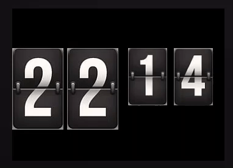

# Flip animation for Fitbit

This library allows you create flip animations in Fitbit apps and clockfaces.



### Installation

Install the library with `npm i fitbit-flip`

   The installer will ask you if it can copy the library gui files in your `resources` folder:  
   Press `Y` and the `fitbit-flip.gui` file will be created automatically.  
   Press `N` if you prefer to copy the file manually afterwards (default choice is Yes)  
  
You still need to modify the `resources/widgets.gui` file to add the link to `fitbit-flip.gui`:
``` xml
<svg>
    <defs>
        <link rel="stylesheet" href="styles.css" />
        <link rel="import" href="/mnt/sysassets/widgets_common.gui" />
        <!-- import fitbit-flip ui file -->
        <link rel="import" href="fitbit-flip.gui" />
    </defs>
</svg>
```


# Usage

Use a `fitbit-flip` symbol in your `index.gui` file:
``` xml
    <use href="#fitbit-flip" id="hour1" x="0" y="65" />
    <use href="#fitbit-flip" id="hour2" x="90" y="65" />
    <use href="#fitbit-flip" id="minute1" x="190" y="65" />
    <use href="#fitbit-flip" id="minute2" x="265" y="65" />
    <!-- Each element represents a separate animation -->
```

Import and use the library in your `app/index.js`:
``` javascript
    import { FitbitFlip } from 'fitbit-flip';

    const hour1 = new FitbitFlip({
        id: "hour1", // id of GUI element
        img_width: 84, //width of image to animate (there will be 2 per element)
        img_height: 67 //height of image to animate (there will be 2 per element)
    });

    //assign images to animate
    hour1.startStaticImage = `new_top.png`; // new image to show (first part)
    hour1.endImage = `new_bottom.png`;  // new image to show (second part)
    hour1.startImage = `old_top.png`;  // old image (first part)
    hour1.endStaticImage = `old_bottom.png`; // old image (second part)

    hour1.flip();    // animate


```

Launch your app and enjoy.

# Demo

A demo is available [here](https://github.com/ygalanter/fitbit-flip-demo)
